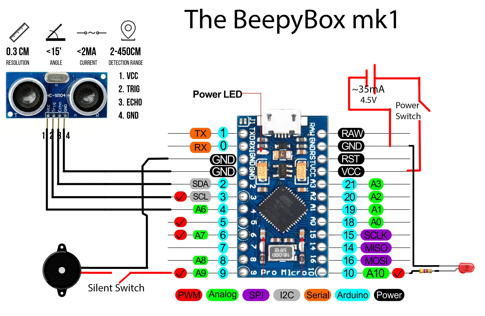

# BeepyBox mk1

The BeepyBox is a small, affordable, and easy to build device that can help you maintain social distance during these funky fresh times.


## What is the BeepyBox?

These instructions will allow you to build your very own BeepyBox! We designed it to use readily available parts, straightforward code, and be accessible for others to make even on a budget and with little experience.

The BeepyBox is a device you can wear on your belt, hook on a lanyard, or even place on your desk. It's designed to let you and folks nearby when they've gotten a little too near. With the inner switch on, the BeepyBox really does beep, but with the switch off, it's nice and quiet with just a flashing LED.

We hope this brings a little help and a little levity to your work-life these days. Whether you are using a BeepyBox or not, please be responsible, safe, and kind to others. The BeepyBox does not replace being attentive to responsible social distancing protocols. Continue to follow official guidelines on social distancing, mask usage, and other health procedures.

## Hardware

### Materials

These are the materials we've used and tested, shown in our diagrams below. Links provided, but feel free to source these from wherever you want!

- [Arduino Pro Micro](https://www.sparkfun.com/products/12640) : [Cheaper, unofficial version here](https://www.amazon.com/gp/product/B07FXCTVQP/)
- [Ultrasonic Distance Sensor HC-SR04](https://www.sparkfun.com/products/15569): [Cheaper version here](https://www.amazon.com/gp/product/B01COSN7O6/)
- Piezzo Buzzer (any one is fine)
- LED (again, use whatever you've got)
- 3x AAA Battery pack (4.5V total, see note below)
- 2 switches (feel free to leave these off if you don't have them)

### Construction



#### Notes

As you'll see in our diagram, we have 4.5V from 3 AAA batteries connected to the VCC pin on the board. If your power source is more than 5 volts, instead connect to the RAW pin in order to use the on-board regulator. Connecting more than 5V to RAW is a Better solution, but this works.

This should be easily adaptable to other Arduino boards. Just be sure to check that your board will be able to source enough current on a pin to power the sensor. We measured it drawing about 2.5 mA, but your milleage may vary.

#### Photos

The photos used in the above reference image are from:
- [Arduino Board](https://www.amazon.com/OSOYOO-ATmega32U4-arduino-Leonardo-ATmega328/dp/B012FOV17O)
- [Ultrasonic sensor](https://create.arduino.cc/projecthub/abdularbi17/ultrasonic-sensor-hc-sr04-with-arduino-tutorial-327ff6)

## Software

### IDE

The easiest way to edit this code and load it onto your Arduino is using the official Arduino IDE, which you can download from [the Arduino website](https://www.arduino.cc/en/Main/Software).

#### Dependencies

You'll also need to download the [New Ping](https://bitbucket.org/teckel12/arduino-new-ping/wiki/Home) Library. Download the [zip file](https://bitbucket.org/teckel12/arduino-new-ping/downloads/NewPing_v1.9.1.zip) and then [import the zip library](https://www.arduino.cc/en/Guide/Libraries#toc4) into your Arduino IDE.

### The Code

Download the beebybox_v0 file and open it in your Arduino IDE. If you've built your board like we have, the code should run as is.

To load the code onto the board, select _Arduino Leonardo_ as the board type under the Tools menu. Plug your board into your computer via USB and then make sure you've selected the correct port as well. Then you should be all set to send the code to the board!

If you get errors, make sure that your hardware and your software agree on what pins you're using. Also make sure that you've included the NewPing library as a dependency in the IDE.

#### Editing the Code

To change the pin numbers to match your hardware, you should only need to change the relevant defines at the top of the code. Those lines look like this, and you should be able to change any of those pin numbers to match your hardware without issue:
```
#define trigPin  3
```

The BeepyBox alerts whenever it seneses something too close to you, that is, something that has come within a predefined danger distance of you, as measured in centimeters read by the sensor. If you want to change the danger distance, look at the line:

```
#define DANGER_RANGE 80 
```

If you want to change the number of danger reads that need to happen in a row before alert mode begins, look at the line:

```
#define REPEAT_READS 4
```

In general, most numbers in the code can be tweaked and tinkered with, but the code as you'll find it is what worked best for us.

## Authors

- **Mech Heise** - *Initial work* - [Heise Guitar Craft](https://www.instagram.com/heiseguitarcraft/)
- **Ash Hansberry** - *Initial work* - [Personal Site](https://sites.google.com/view/ashley-hansberry/home)

See also the list of [contributors](contributors) who participated in this project.

## License

This project is licensed under the GPL 3.0 License- see the [License](LICENSE) for details.
